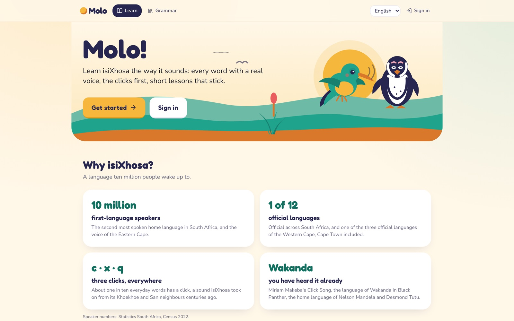
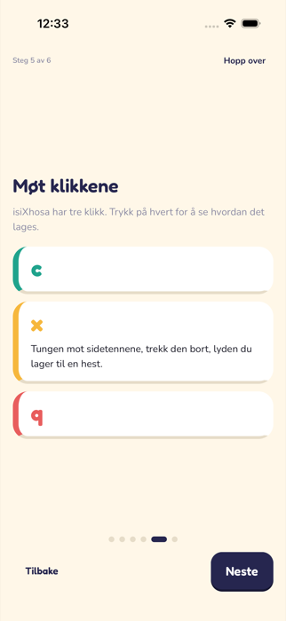
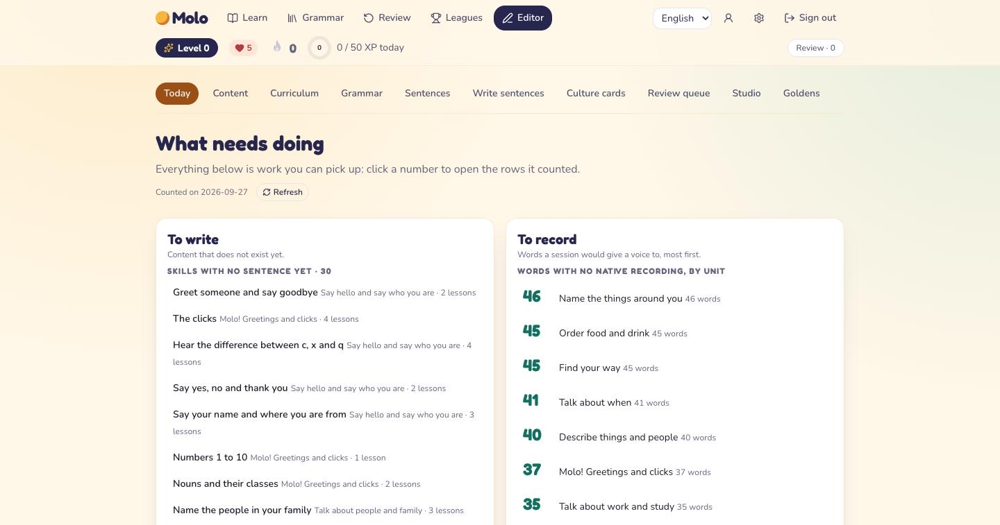
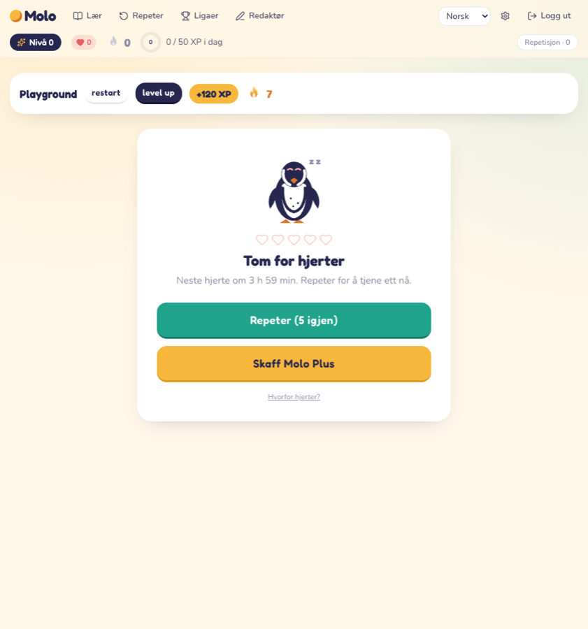

<p align="center">
  
</p>

# Molo

**isiXhosa, click by click.** Molo is a gamified isiXhosa course for English
and Norwegian speakers, on the web at [hellomolo.com](https://hellomolo.com)
and as an iOS and Android app. It looks like the language apps you know:
short lessons, a path, streaks, hearts, leagues. Underneath, it is built
around one fact about isiXhosa: it is a tonal click language with a
fifteen-class noun system, and a language model will confidently teach you
something wrong in it.

> *Molo* is "hello" to one person. *Molweni* is hello to several. The course
> opens with that difference, and with the clicks.

This repository is an **open-source snapshot** of Molo's code, built for the
[RevenueCat Shipaton 2026](https://www.shipaton.com/) (Next Gen Award). It is
one commit of the working tree, not the project's history. The course content
is not in it; see [What is not included](#what-is-not-included).

<p align="center">
  
  
  
</p>
<p align="center"><sub>The sunbird sings, the penguin learns, the crane explains.</sub></p>

<table>
  <tr>
    <td align="center" width="68%"><br><sub>hellomolo.com</sub></td>
    <td align="center"><br><sub>Onboarding: the clicks first</sub></td>
  </tr>
  <tr>
    <td align="center"><br><sub>The editor dashboard, where content is written, recorded and approved</sub></td>
    <td align="center"><br><sub>Out of hearts: practise, wait, or Molo Plus</sub></td>
  </tr>
</table>

## The rule everything else follows

> **No learner ever sees content that a human isiXhosa editor has not approved.**

That is a property of the code, not a guideline:

- **Every content row has a status**: `draft`, `ai_draft`, `in_review`,
  `published` or `retired`. Learner endpoints and repositories read
  `published` only, and there is no parameter that widens them.
- **One function can write `published`**: `transition()` in
  [`packages/core/src/status.ts`](packages/core/src/status.ts). It requires an
  `editor` or `admin`, refuses an editor's approval of their own work (an
  admin's is allowed and written into the revision), and runs the publish
  gates first: a word needs native audio (a tier 1 recording or a licensed
  tier 2 one, never synthetic speech), an English and a Norwegian gloss, a
  licence and a source, and forms that the grammar engine can verify.
- **Anything a language model drafts enters as `ai_draft`** and can only
  reach a learner through that same human review. The CLI's `molo content
  promote` can move a row to review, never to published.
- **Inflection and noun-class agreement are not asked of a model at all.**
  They come from `xh-morph`, a rule-based generator in Rust over a validated
  lexicon. If it cannot generate a form, the exercise is not generated.
- **`bun run test:integrity`** runs against a real Postgres and asserts all
  of this: drafts never leak through a learner route, no other write path
  sets `published`, and audio that is in review, retired or synthetic is never
  served to a learner.

Editors can preview unpublished lessons, but only on separate
`/edit/preview/*` routes that require an editor session and keep no progress;
the learner routes and repositories stay published-only whatever a client
sends.

## Architecture

```text
apps/
  api/          Hono on Cloudflare Workers: auth, learner and editor routes, webhooks, crons, queue consumers
  web/          TanStack Start on Workers: the learner app and the editor dashboard (/edit/*)
  mobile/       Expo SDK 57 / React Native: the learner app, offline unit cache, role-gated editor review
packages/
  core/         domain types, the status machine, publish gates, exercise contracts (Effect Schema). No I/O.
  db/           Drizzle schema, migrations, repositories. The only module that knows tables.
  i18n/         UI strings in English and Norwegian (react-i18next)
  content/      ingest adapters (isixhosa.click, Forvo, corpora) that produce draft rows only
  scheduler/    FSRS spaced repetition over the xh-fsrs WASM build
  gamification/ XP, levels, streaks, hearts, leagues, Molo Plus entitlements
  cli/          `molo`, the operations CLI; dry run by default, --live to act
  sfx/, brand/  sound effects; logo, mascots, store artwork, legal texts
  testkit/      fixtures, golden cases, the integrity suite
crates/
  xh-morph/     noun-class and concord generator (Rust, native and WASM), golden-tested
  xh-audio/     audio pipeline: decode, trim, loudness-normalise to -16 LUFS, resample, encode, manifest
  xh-fsrs/      fsrs-rs (the FSRS implementation Anki uses) compiled to WASM
infra/          Alchemy (Cloudflare Workers, R2, Queues, Hyperdrive), Docker Compose for local
docs/           design documents (start with docs/ARCHITECTURE.md)
curriculum/     the course spine and editor-facing JSON (all rights reserved, see LICENSE-assets)
```

| Layer | Choice |
|---|---|
| Runtime, workspaces | Bun |
| API | Hono on Cloudflare Workers, Effect Schema at every boundary |
| Database | Postgres through Cloudflare Hyperdrive, Drizzle ORM and migrations |
| Web | TanStack Start, Tailwind, TanStack Query, React Aria, Motion |
| Mobile | Expo SDK 57, NativeWind, op-sqlite with SQLCipher for the offline cache |
| Auth | Better Auth (email, Sign in with Apple, Google), roles `learner`, `editor`, `admin` |
| Audio | Cloudflare R2 and Queues; `xh-audio` in Rust processes every recording |
| Grammar | `xh-morph` in Rust, used natively and as WASM in the Worker |
| Scheduling | FSRS through `fsrs-rs`, as WASM |
| Payments | RevenueCat (below) |
| Tests | Vitest, Playwright, Jest, `cargo test`, integrity tests against Docker Postgres |
| Observability | Sentry on the Worker, web and mobile |

**Why Rust in three places.** `xh-morph` is the part that must be correct by
construction, so it is a small finite-state generator with golden tests
rather than TypeScript string handling. `xh-audio` needs real decoding and
loudness measurement (`symphonia`, `ebur128`, `rubato`). `xh-fsrs` wraps the
reference FSRS implementation instead of re-implementing a scheduler.
Everything else is TypeScript.

### RevenueCat: Molo Plus

Molo Plus (monthly or yearly) gives unlimited hearts, a streak freeze and
offline units in the app, and pays for recordings by isiXhosa speakers. It is
sold through RevenueCat on every platform:

- **iOS and Android**: `react-native-purchases` behind Molo's own paywall
  screen ([`apps/mobile/src/lib/purchases.ts`](apps/mobile/src/lib/purchases.ts),
  [`apps/mobile/app/plus.tsx`](apps/mobile/app/plus.tsx)), with restore
  purchases. The RevenueCat app user id is the Molo account id, so a
  subscription follows the learner across devices and the web.
- **Web**: RevenueCat Web Billing through `@revenuecat/purchases-js`
  ([`apps/web/src/routes/plus.tsx`](apps/web/src/routes/plus.tsx)), offered
  to accounts registered in Norway; elsewhere the page points to the stores.
- **Server**: the API never trusts a client about a purchase. RevenueCat's
  webhook ([`apps/api/src/routes/webhooks.ts`](apps/api/src/routes/webhooks.ts))
  is authenticated by a shared secret, decoded with Effect Schema, applied
  idempotently to the learner's plan
  ([`packages/gamification`](packages/gamification)), and is the only thing
  that grants or ends Plus.

Plus never changes what is taught: every lesson and every word is the same
for free and paying learners.

## Run it locally

You need [Bun](https://bun.sh) 1.3 or later, Docker, and a Rust toolchain
(stable) if you want to build the crates.

```bash
bun install
docker compose up -d            # Postgres (host port 55432), MinIO (R2 stand-in), Mailpit
cp .env.example .env            # local defaults only; never commit .env
cp apps/api/.dev.vars.example apps/api/.dev.vars
cp apps/web/.env.example apps/web/.env
bun run db:migrate
bun run db:seed                 # languages, the course row, noun classes; no content

bun run up                      # API on :8787, web on :3300, and a local dev account
```

`bun run up` waits for Postgres to answer queries, applies migrations,
starts the API, waits for `/health`, creates the local dev account through
the running API, and starts the web server. Ctrl-C stops both. To create
other accounts:

```bash
bun run molo dev user dev-admin@molo.local --live               # admin + editor + learner
bun run molo dev user tester@molo.local --role learner --live
```

The password is the fixture value `molo-dev-1234`. The command refuses any
database or API that is not local.

**A fresh install shows an empty course path, and that is correct.** Nothing
is published until an editor approves it. To see the learner interface
without content, open `/dev` in a development build: a gallery that renders
every screen and exercise type on fixtures. To load the isiXhosa lexicon as
drafts for the editor dashboard:

```bash
bun run molo content ingest isixhosa-click          # dry run: what would be written
bun run molo content ingest isixhosa-click --live   # about 2 100 draft lexemes from isixhosa.click (CC BY-SA 4.0)
```

The mobile app: `bun run --filter @molo/mobile start` (Expo). It talks to
`localhost:8787`; an Android emulator needs `adb reverse tcp:8787 tcp:8787`.

Every `molo` command that costs money, writes to production or calls a paid
API is a dry run unless given `--live`. `bun run molo doctor` reports which
credentials resolve and which services answer, never their values. None of
the external services (Forvo, Resend, Anthropic, Google Translate,
RevenueCat, Sentry, Slack) is needed to run locally; without their keys the
feature is switched off or only logs what it would have done.

### Checks

```bash
bun run lint && bun run typecheck
bun run test                               # unit tests (packages and web)
bun run --cwd apps/mobile test             # mobile (Jest)
cargo test --workspace -- --skip golden_classes_1_10
bun run test:integrity                     # needs Docker Postgres
bun run test:e2e                           # Playwright; needs Docker Postgres
```

**The golden test is red on purpose.** `cargo test` without the `--skip`
fails `golden_classes_1_10`: every case in
[`crates/xh-morph/golden/classes_1_10.toml`](crates/xh-morph/golden/classes_1_10.toml)
asks for a form a native speaker must supply, and in this snapshot every
answer is empty. An unfilled golden is a rule nobody has checked, and the
crate is not allowed to look green while that is true. The rule table itself
marks every class `validated = false`, so the product never trusts a
generated form until a speaker has signed it off.

## What is not included

Deliberately left out of this snapshot:

- **Course content.** The lexicon rows, glosses, sentences, exercises and
  approvals live in the production database, not in the repository. The
  Phase 0 draft lexicon and draft Unit 1 files are not included either; the
  seed works without them.
- **Recordings.** No isiXhosa speaker's voice is in this repository. Tier 1
  recordings are made in the dashboard's studio with the speaker's consent and
  stay in private storage.
- **The tutor's answers.** The golden forms a native-speaker tutor has given
  are hers; the golden file here keeps its cases and leaves every answer empty.
- **Anything derived from bought reference books.** Editors look words up in
  copyrighted dictionaries and grammars; those lookups, and the tooling that
  used them, are not published.
- **Third-party corpora** and the script that downloads them. The ingest
  adapters that read them are included.
- **Internal operations**: business planning, research notes, store-review
  notes, incident logs, agent prompts, and the CI and deployment workflows
  (they deploy the production stack). Some code comments and docs still point
  to those internal documents by name.

## Licence

- **Code**: [GNU Affero General Public License v3.0](LICENSE), copyright
  Hardmax AS.
- **Name, logo, mascots, illustrations, sound effects, recordings, the
  curriculum and the legal texts**: all rights reserved, Hardmax AS. See
  [LICENSE-assets](LICENSE-assets).
- **Data adapted from [IsiXhosa.click](https://isixhosa.click/)** (the lemmas
  and glosses in the golden test cases, and the lexicon the ingest adapter
  loads): [CC BY-SA 4.0](https://creativecommons.org/licenses/by-sa/4.0/).
  The approved Molo lexicon is offered under the same licence at
  [hellomolo.com/lexicon](https://hellomolo.com/lexicon).
- **Third-party libraries** keep their own licences:
  [`packages/brand/legal/attributions.en.md`](packages/brand/legal/attributions.en.md)
  and [`packages/brand/generated/`](packages/brand/generated).

---

Built by [Hardmax AS](https://hellomolo.com) for **RevenueCat Shipaton 2026**.
Questions: [support@hellomolo.com](mailto:support@hellomolo.com).
